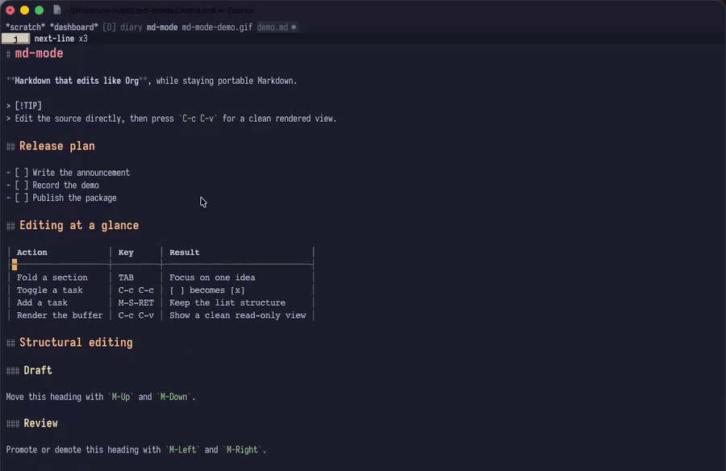

# md-mode

Markdown in Emacs with live styling, source-preserving tables, a live
document outline, and an Org-inspired editing workflow.

`md-mode` is an opinionated major mode for people who enjoy the direct,
structural editing of Org mode but need their files to remain ordinary
Markdown.

It provides two views of the same buffer:

- **Edit view** keeps the original Markdown as buffer text while font-lock
  styles headings, emphasis, links, blockquotes, callouts, fenced code, and
  tables.
- **Rendered view** removes the visible markup and presents a read-only,
  in-buffer rendering. `C-c C-v` returns to the exact editable source.

## Demo



[Watch the complete 87-second demo](docs/demo.mp4).

## Why md-mode?

- **Styled while editable.** Heading scale, emphasis, code, links, quotes,
  callouts, and table decoration are visible without leaving the source
  buffer.
- **Tables that remain Markdown.** Tables auto-align, display with box-drawing
  borders, truncate cleanly at the window edge, and can be created or deleted
  as complete structures. The file still contains normal pipe-table syntax.
- **Structure beside the document.** A live TOC shows ATX headings in a side
  window and jumps through the same marker-backed index used by Imenu.
- **Org-like structural editing.** Fold sections, navigate headings, promote
  or demote subtrees, continue lists, toggle tasks, and edit table rows and
  columns with familiar keys.
- **No required preview toolchain.** The core in-buffer renderer needs no
  Pandoc, browser, or external Markdown processor. Optional local tools add
  previews for LaTeX math, Mermaid, PlantUML, and Graphviz diagrams.
- **Small and self-contained.** `md-mode` depends only on Emacs 29.1 or newer.

## Compared with markdown-mode

[`markdown-mode`](https://github.com/jrblevin/markdown-mode) is the mature,
general-purpose choice. It supports more Markdown variants, a large
customization surface, HTML export and preview workflows, and an established
package ecosystem.

`md-mode` makes a narrower set of choices:

|                  | md-mode                                                                          | markdown-mode                                                                                    |
|------------------|----------------------------------------------------------------------------------|--------------------------------------------------------------------------------------------------|
| Primary goal     | A styled, Org-like Markdown workspace                                            | Broad Markdown editing and tooling                                                               |
| Editable display | Live styling is the default experience                                           | Syntax-oriented by default; markup hiding and heading scaling are optional                       |
| Complete preview | Read-only rendering in the same buffer, built in                                 | HTML preview and export through a configured Markdown processor                                  |
| Tables           | Created, deleted, auto-aligned, box-drawn, width-aware, and structurally editable | Part of a wider, more configurable editing environment                                           |
| Workflow         | Compact Org-style key set with a built-in per-buffer TOC                          | Extensive command set covering more Markdown conventions                                         |
| Scope            | Common Markdown/GFM authoring, currently focused on .md files and ATX headings | Multiple filename conventions, markdown-mode, gfm-mode, extensions, export, and integrations |

Choose `md-mode` when the editing surface itself matters most: you want a
document that looks structured while it remains editable, and you want
same-buffer rendering without an external command.

Choose `markdown-mode` when format coverage, export pipelines, mature
integrations, or long-term compatibility are more important.

## Requirements

- Emacs 29.1 or newer

Optional Rendered-view integrations:

- LaTeX math (`\(…\)`, `\[…\]`, `$$…$$`, and fenced `math`/`latex`):
  `latex` plus `dvisvgm`.
- Fenced `mermaid` diagrams: Mermaid CLI (`mmdc`) and a local Chrome or
  Chromium installation.
- Fenced `plantuml`/`puml` diagrams: the local PlantUML CLI.
- Fenced `dot`/`graphviz` diagrams: the local Graphviz `dot` executable.

All integrations render asynchronously and cache generated images under
`md-render-cache-directory`. Missing tools leave math literal or diagrams as
normal source blocks. No document content is sent to a remote service.
PlantUML runs with its `SANDBOX` security profile, and Graphviz runs in its
restricted server mode to limit external resource loading.

## Installation

Install directly from the repository with Emacs:

```text
M-x package-vc-install RET https://github.com/yibie/md-mode RET
```

Or clone the repository and add it to `load-path`:

```sh
git clone https://github.com/yibie/md-mode.git
```

```elisp
(add-to-list 'load-path "/path/to/md-mode")
(require 'md-mode)
```

For `straight.el` users:

```elisp
(use-package md-mode
  :straight (:type git :host github :repo "yibie/md-mode")
  :mode ("\\.md\\'" . md-mode))
```

Files ending in `.md` will then open in `md-mode`.

## Quick start

Open a Markdown file and edit normally. The source stays writable and is
styled as you type.

- Press `TAB` on a heading, front matter opener, or fenced code opener to fold
  or reveal it.
- Press `C-c C-c` on `- [ ]` to toggle it to `- [x]`.
- Press `M-S-RET` to create another task.
- Press `C-c |` outside a table to create one, or inside a table to align it.
- Press `C-c C-t` to open a live heading TOC beside the document.
- Press `C-c C-v` to enter the complete rendered view; press it again to
  restore the source.

## Key bindings

### Headings and structure

| Key               | Action                                            |
|-------------------|---------------------------------------------------|
| C-c C-n / C-c C-p | Next / previous heading                           |
| TAB / S-TAB       | Cycle a section or block / cycle the whole document |
| C-RET             | Insert a same-level heading                       |
| M-Left / M-Right  | Promote / demote a heading subtree                |
| M-Up / M-Down     | Move the current heading, list item, or table row |
| C-c C-u           | Move to the parent heading                        |
| C-c C-f / C-c C-b | Next / previous same-level heading                |
| C-c C-j           | Jump to a selected heading                        |
| C-c C-t           | Toggle the live heading TOC (`md-mode-toggle-toc`) |
| C-c @             | Mark the current subtree                          |
| M-h               | Mark the current structural element               |

### Lists and tasks

| Key              | Action                                   |
|------------------|------------------------------------------|
| M-RET            | Continue an ordered or unordered list    |
| M-S-RET          | Insert an unchecked task                 |
| C-c C-c          | Toggle the task at point                 |
| C-c -            | Cycle unordered and ordered list markers |
| M-Left / M-Right | Outdent / indent a list item             |
| M-Up / M-Down    | Move a list item                         |

### Tables

| Key                        | Action                                      |
|----------------------------|---------------------------------------------|
| C-c \|                     | Create or align (`md-mode-table`)            |
| M-x md-mode-insert-table   | Create a sized table (default: 3 × 2)        |
| TAB                        | Align the table and move to the next cell   |
| C-c C-c                    | Align the table                             |
| M-Left / M-Right           | Move the current column                     |
| M-Up / M-Down              | Move the current row                        |
| M-S-Left / M-S-Right       | Delete / insert a column                    |
| M-S-Up / M-S-Down          | Delete / insert a row                       |
| M-x md-mode-delete-table   | Delete the complete table at point          |

### Links and blocks

| Key       | Action                                    |
|-----------|-------------------------------------------|
| C-c C-l   | Insert or edit a web, file, or email link |
| C-c C-i   | Insert or edit an image                   |
| C-c C-o   | Open the link at point                    |
| C-c C-s q | Insert a blockquote                       |
| C-c C-s c | Insert inline code or a fenced code block |
| C-c C-s a | Insert a GitHub-style callout             |
| C-c C-v   | Toggle editable source and rendered view  |

## Customization

Use `M-x customize-group RET md RET` for editing behavior and
`M-x customize-group RET md-render RET` for renderer faces and options.
`setopt` is recommended in Emacs configuration because it runs each option's
Custom setter.

### Option reference

Editing and structure:

| Option | Default | Purpose |
|--------|---------|---------|
| `md-mode-auto-align-tables` | `t` | Align Markdown tables when entering `md-mode` |
| `md-mode-fold-front-matter-on-open` | `nil` | Start with front matter folded |
| `md-mode-use-markdown-mode-faces` | `t` | Reuse compatible faces when `markdown-mode` faces are already loaded |
| `md-mode-toc-side` | `left` | Open the TOC on the left or right |
| `md-mode-toc-width` | `30` | Set the TOC width in columns |
| `md-mode-heading-scaling-values` | `(2.0 1.7 1.4 1.1 1.0 1.0)` | Set relative sizes for heading levels one through six |

Rendered images and tables:

| Option | Default | Purpose |
|--------|---------|---------|
| `md-render-image-max-width` | `0.4` | Limit inline images by a window-width ratio or pixel count |
| `md-render-prettify-tables` | `t` | Render tables with aligned columns |
| `md-render-table-use-unicode-borders` | `t` | Use Unicode rather than ASCII table borders |
| `md-render-table-wrap-columns` | `t` | Wrap table cells to fit the window |
| `md-render-table-max-width-fraction` | `0.9` | Limit wrapped tables to a fraction of the window width |
| `md-render-table-zebra-stripe` | `t` | Alternate table row backgrounds |

Local media rendering:

| Option | Default | Purpose |
|--------|---------|---------|
| `md-render-math-enabled` | `t` | Render supported LaTeX math when local tools are available |
| `md-render-math-scale` | `1.0` | Scale generated math previews |
| `md-render-mermaid-enabled` | `t` | Render Mermaid fenced blocks |
| `md-render-mermaid-command` | `"mmdc"` | Select the Mermaid CLI executable |
| `md-render-mermaid-browser` | `nil` | Select a browser executable, or auto-detect one |
| `md-render-plantuml-enabled` | `t` | Render PlantUML fenced blocks |
| `md-render-plantuml-command` | `"plantuml"` | Select the PlantUML executable |
| `md-render-graphviz-enabled` | `t` | Render Graphviz fenced blocks |
| `md-render-graphviz-command` | `"dot"` | Select the Graphviz executable |
| `md-render-cache-directory` | `(locate-user-emacs-file "md-render/")` | Store generated preview files |

Advanced renderer integration:

| Option | Default | Purpose |
|--------|---------|---------|
| `md-render-language-mapping` | Common language aliases | Map fenced-block language names to Emacs major modes |
| `md-render-render-functions` | `(md-render--render-media)` | Register renderers that claim and freeze regions before styling |

Tables align automatically when `md-mode` starts. Disable that behavior
without changing table rendering:

```elisp
(setq md-mode-auto-align-tables nil)
```

The TOC opens on the left at 30 columns. Change either default without
affecting Imenu or heading navigation:

```elisp
(setq md-mode-toc-side 'right
      md-mode-toc-width 36)
```

The TOC works in Edit view and Rendered view. Press `RET` or click an entry to
jump, `g` to refresh manually, and `q` to close its window.

Front matter and fenced code blocks fold with `TAB` on their opening
delimiter. To start with front matter folded:

```elisp
(setq md-mode-fold-front-matter-on-open t)
```

When `markdown-mode` faces are already defined, `md-mode` reuses compatible
emphasis, link, quote, table, and code faces buffer-locally. It does not load
or depend on `markdown-mode`. Disable compatibility with:

```elisp
(setq md-mode-use-markdown-mode-faces nil)
```

### Heading sizes

Customize `md-mode-heading-scaling-values` to set the relative size of heading
levels one through six:

```elisp
(setopt md-mode-heading-scaling-values
        '(1.8 1.6 1.4 1.2 1.0 1.0))
```

Like Org, each level also has its own face. Use `M-x customize-face` with
`md-render-header-1` through `md-render-header-6` to override an individual
level. A saved face customization takes precedence over the scaling values,
which remain independent of `markdown-mode` face compatibility.

Graphical frames keep these faces color-neutral and distinguish levels with
the configured relative heights. Terminal frames cannot vary font size, so
they use separate high-contrast palettes for dark and light backgrounds while
inheriting other attributes from `org-level-1` through `org-level-6`. Users can
override any level with `M-x customize-face`, and themes may customize the
`md-render-header-*` faces directly.

### CJK font sizing

Heading faces use relative heights. If a CJK fallback font is configured with
an absolute `:size`, Emacs keeps that size instead of scaling it with the
heading, so Latin and CJK text can appear at different sizes. Configure the
fallback family without `:size`:

```elisp
(dolist (script '(kana han cjk-misc bopomofo))
  (set-fontset-font
   t script (font-spec :family "Noto Sans CJK SC")))
```

The fallback font will still inherit the default body size, while headings
scale normally. The same rule applies to Org and `markdown-mode` heading
faces.

Here is a ready-to-copy configuration with the main commands grouped under
`C-c m`; replace the keys to match your setup:

```elisp
(use-package md-mode
  :straight (:type git :host github :repo "yibie/md-mode")
  :mode ("\\.md\\'" . md-mode)
  :bind (:map md-mode-map
              ("C-c m v" . md-mode-toggle-markup)
              ("C-c m t" . md-mode-toggle-toc)
              ("C-c m j" . md-mode-goto-heading)
              ("C-c m b" . md-mode-cycle-block)
              ("C-c m |" . md-mode-table))
  :custom
  (md-mode-fold-front-matter-on-open t)
  (md-mode-toc-side 'left)
  (md-mode-toc-width 30))
```

## Current scope

`md-mode` is an early-stage, focused package rather than a drop-in replacement
for every `markdown-mode` workflow. It currently targets common Markdown and
GitHub-style authoring and associates itself with `.md` files.

Browser preview, HTML export, wiki links, footnotes, and the broader dialect
coverage of `markdown-mode` are outside its present scope.

Fenced code receives a block face in Edit view. Language-specific syntax
highlighting remains a Rendered-view feature.

Rendered view also recognizes local LaTeX math and fenced Mermaid, PlantUML,
and Graphviz diagrams when their optional executables are installed. Customize
`md-render-math-enabled`, `md-render-mermaid-enabled`,
`md-render-mermaid-browser`, `md-render-plantuml-enabled`,
`md-render-plantuml-command`, `md-render-graphviz-enabled`,
`md-render-graphviz-command`, and `md-render-cache-directory` to control these
integrations.

The TOC, Imenu, and structural commands index ATX headings (`#` through
`######`) in the current buffer only. Setext headings and project-wide indexes
are not included.

## Development

Run the complete test suite:

```sh
emacs -Q --batch -L . -L test \
  -l test/md-render-tests.el \
  -l test/md-mode-tests.el \
  -f ert-run-tests-batch-and-exit
```

`md-render.el` is adapted from
[`agent-shell-markdown.el`](https://github.com/xenodium/agent-shell/blob/main/agent-shell-markdown.el)
by Alvaro Ramirez.

`md-mode` and its adapted renderer are licensed under GPLv3 or later.
