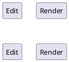
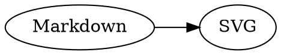

# md-mode v0.2

> Org-style editing · same-buffer rendering · local diagrams

## 1. Structure & navigation

- `C-c C-n` / `C-c C-p`: next / previous heading
- Promote, demote, move, fold headings and subtrees
- Lists, TODO items, links, blocks, TOC and Imenu

## 2. CJK typography & tables

### 中日韩标题随层级缩放 / CJK-font scaled headings

| type         | render mode      | status |
|--------------|------------------|--------|
| 中文 / Latin | pixel-align      | ✓      |
| Wide table   | auto-wrap        | ✓      |

## 3. Local media rendering

Inline math: \( E = mc^2 \)

Local · async · cached · source-preserving
